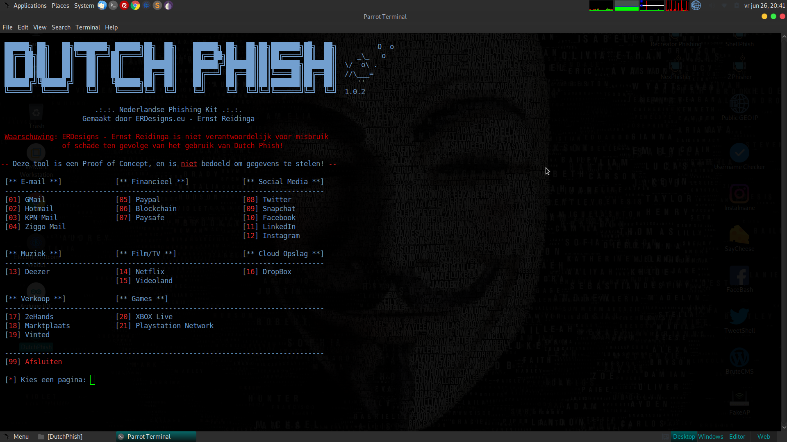

# DutchPhish
Dutch Phishing toolkit - Nederlandstalige Phishing Toolkit voor Ethical Hackers

```
Portions used from ShellPhish - thanks to Linux_choise
ShellPhish is Coded by: linux_choice - https://github.com/thelinuxchoice/shellphish
```

<b>Gemaakt door ERDesigns.eu - Ernst Reidinga</b><br>
<b>Deze tool is een Proof of Concept, en is niet bedoeld om gegevens te stelen!</b><br><br>
ERDesigns - Ernst Reidinga is niet verantwoordelijk voor misbruik of schade ten gevolge van het gebruik van Dutch Phish!



De pagina's zijn verdeeld per categorie, en sommige pagina's hebben nog een extra keuze (bv. Facebook). De pagina's zijn gemaakt in VueJS en zijn gecompiled. Er zit dus buiten de PHP geen code bij van de pagina's zelf. Bij interesse kan je altijd een bericht sturen via het contactformulier op onze <a href="https://erdesigns.eu/app/start/contact" target="_blank">website</a>

Ik ga er vanuit dat als je deze kit download dat je weet hoe deze werkt, dus geen contact opnemen als je niet begrijpt hoe het werkt.<br><b>Deze kit is gemaakt en getest op Parrot Security OS.</b>

Als je deze kit gebruikt, delen ervan gebruikt of aanpassingen doet zou het fijn zijn als je ons op de hoogte wilt stellen. Als je nieuwe ideeen hebt of verbeteringen, zijn ook altijd welkom.
